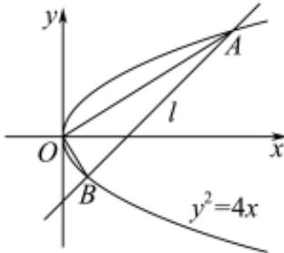

> [!faq]- 2022-2023学年内蒙古包头高二上学期期末数学试卷解析
>
> > [!success]- **【答案】** 详见解析 $x = 4$ 或 $3x - 4y - 12 = 0$
>
> > [!note]- **【分析】**
> > 根据题意结合垂径定理可得 $C$ 到准线距离为 $d = 1$ ，进而可得抛物线的方程；
>
> > [!note]- **【解析】**
> > 圆 $x^{2}+y^{2}-2y-3=0$ ，即 $x^{2}+(y-1)^{2}=4$ ，圆心 $C(0,1)$ ，半径为2，则C到准线距离为 $d=\sqrt{2^{2}-\left(\sqrt{3}\right)^{2}}=1$ ，所以准线方程为 $x=\frac{p}{2}=-1$ ，可得p=2，所以抛物线标准方程为 $y^{2}=4x$
> >
> > 2.
> >
> > 设直线 $AB$ 方程为 $x = my + 4, A\left(\frac{y_1^2}{4}, y_1\right), B\left(\frac{y_2^2}{4}, y_2\right)$ ，联立方程 $\left\{ \begin{array}{l} x = my + 4 \\ y^2 = 4x \end{array} \right.$ ，消去 $\times$ 得 $y^2 - 4my - 16 = 0$ ，则 $\Delta = 16m^2 + 64 > 0$ ，可得 $y_1 \cdot y_2 = -16$ ，又因为
> >
> > $$
> > \overrightarrow {O A} = \left(\frac {y _ {1} ^ {2}}{4}, y _ {1}\right), \overrightarrow {O B} = \left(\frac {y _ {2} ^ {2}}{4}, y _ {2}\right) \text {, 则} \overrightarrow {O A} \cdot \overrightarrow {O B} = \frac {(y _ {1} y _ {2}) ^ {2}}{1 6} + y _ {1} y _ {2} = \frac {(- 1 6) ^ {2}}{1 6} + (- 1 6) = 0
> > $$
> >
> > ，可得 $O'A \perp OB'$ ，即以线段AB为直径的圆过点M。
> >
> > 
