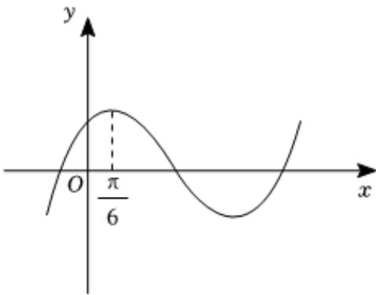

<!-- question-source:start -->
4、已知函数 $f(x) = \sin (x + \varphi)(|\varphi| < \frac{\pi}{2})$ 的部分图象如图所示，为了得到函数 $y = \sin x$ 的图象，只要把 $y = f(x)$ 的图象上所有的点（）

A 向左平行移动 $\frac{\pi}{6}$ 个单位长度  
B 向右平行移动 $\frac{\pi}{6}$ 个单位长度  
C 向左平行移动 $\frac{\pi}{3}$ 个单位长度  
D 向右平行移动 $\frac{\pi}{3}$ 个单位长度
<!-- question-source:end -->

![[Q00092139A1]]
