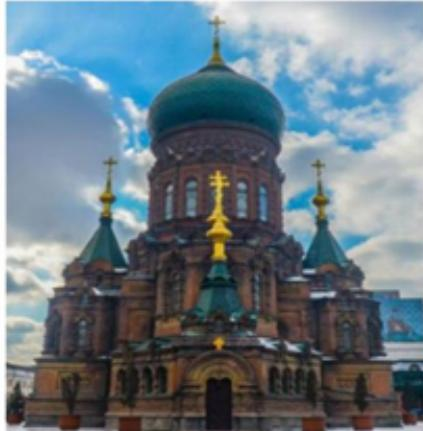
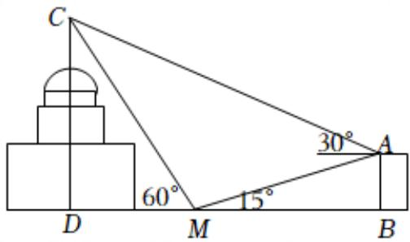

<!-- question-source:start -->
5、圣索菲亚教堂是哈尔滨的标志性建筑，其中央主体建筑集球，圆柱，棱柱于一体，极具对称之美，可以让游客从任何角度都能领略它的美。小明同学为了估算索菲亚教堂的高度，在索菲亚教堂的正东方向找到一座建筑物AB，高为 $(15\sqrt{3}-15)m$ ，在它们之间的地面上的点 $M(B,M,D$ 三点共线）处测得楼顶A，教堂顶C的仰角分别是 $\frac{\pi}{12}$ 和 $\frac{\pi}{3}$ ，在楼顶A处测得塔顶C的仰角为 $\frac{\pi}{6}$ ，则小明估算索菲亚教堂的高度为（）

A 20m
B 30m
C $20\sqrt{3}m$ D $30\sqrt{3}m$
<!-- question-source:end -->

![[Q00092140A1]]
