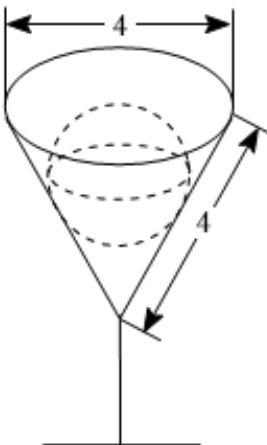

<!-- question-source:start -->
4、如图，一个盛满溶液的玻璃杯，其形状为一个倒置的圆锥，现放入一个球状物体，使其完全浸没于杯中，球面与圆锥侧面相切，且与玻璃杯口所在平面相切，则（）

A 此圆锥的侧面积为 $8\pi$ B 球的表面积为 $\frac{16\pi}{3}$ C 原玻璃杯中溶液的体积为 $\frac{16\pi}{3}$ D 溢出溶液的体积为 $\frac{32\sqrt{3}\pi}{27}$
<!-- question-source:end -->

![[Q00092147A1]]
