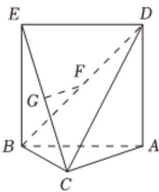

<!-- question-source:start -->
5、如图所示，在四棱锥 $C - ABED$ 中，四边形ABED是平行四边形，点 $\pmb{G}$ ， $\pmb{F}$ 分别是线段EC，BD的中点.

(1)求证： $GF / /$ 平面ABC

(2) $H$ 是线段 $BC$ 的中点，证明：平面 $GFH \parallel$ 平面 $ACD$ .

<!-- question-source:end -->

![[Q00092155A1]]
