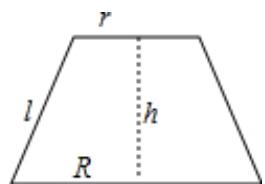

> [!faq]- 2022-2023学年内蒙古呼和浩特二中高一（下）期末数学试卷解析
>
> > [!success]- **【答案】** A
>
> > [!note]- **【解析】**
> > 画出圆台的轴截面，如图所示：
> >
> > 设圆台的母线长为 $l$ 、高为 $\pmb{h}$ ，上、下两底面圆的半径分别为 $\pmb{r}$ ， $\pmb{R}$
> >
> > 因为上、下底面面积分别为 $36\pi$ 和 $49\pi$ ，所以 $\pmb {r} = 6$ ， $R = 7$
> >
> > 因为 $l^2 = h^2 + (R - r)^2$
> >
> > 即 $17 = h^{2} + (7 - 6)^{2}$ ，
> >
> > 
> >
> > 解得h=4，
> >
> > 所以两底面之间的距离为4.
> >
> > 故选：A.
