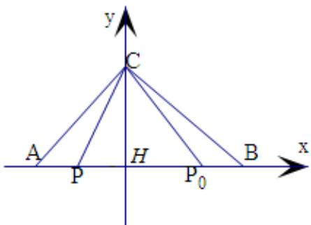

> [!faq]- 2022-2023学年内蒙古呼和浩特二中高一（下）期末数学试卷解析
>
> > [!success]- **【答案】** D
>
> > [!note]- **【解析】**
> > 设 $|\overrightarrow{AB}| = 4$ ，则 $|\overrightarrow{P_0B}| = 1$ ，过点 $C$ 作 $AB$ 的垂线，垂足为 $H$ ，在 $AB$ 上任取一点 $P$ ，设 $HP_0 = a$ ，则由数量积的几何意义可得，
> >
> > $$
> > \overrightarrow {P B} \bullet \overrightarrow {P C} = | \overrightarrow {P H} | \cdot | \overrightarrow {P B} | = | \overrightarrow {P B} | ^ {2} - (a + 1) | \overrightarrow {P B} |
> > $$
> >
> > $$
> > \overrightarrow {P _ {0} B} \cdot \overrightarrow {P _ {0} C} = - a
> > $$
> >
> > 于是 $\overrightarrow{PB} \cdot \overrightarrow{PC} \geqslant \overrightarrow{P_0B} \cdot \overrightarrow{P_0C}$ 恒成立，
> >
> > 
> >
> > 整理得 $|\overrightarrow{PB}|^2 -(a + 1)|\overrightarrow{PB}| + a\geqslant 0$ 恒成立，
> >
> > 只需 $\Delta = (a + 1)^2 - 4a = (a - 1)^2 \leqslant 0$ 即可，于是 $a = 1$
> >
> > 因此我们得到 $HB = 2$ ，即 $H$ 是 $AB$ 的中点，故 $\triangle ABC$ 是等腰三角形，
> >
> > 所以AC = BC.
> >
> > 故选：D.
