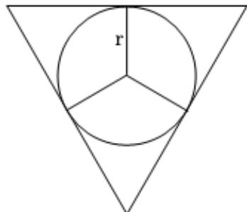

> [!faq]- 2022-2023学年内蒙古呼和浩特二中高一（下）期末数学试卷解析
>
> > [!success]- **【答案】** ABD
>
> > [!note]- **【解析】**
> > 如图，
> >
> > 
> >
> > 球心为圆锥轴截面三角形的中心，设圆锥的底面圆半径为 $R$ ，高为 $\pmb{h}$ ，母线长为 $l$ ，球的半径为 $\pmb{r}$
> >
> > 则由题意得 $R = 2$ ， $l = 4$ ， $h = \sqrt{l^2 - R^2} = \sqrt{4^2 - 2^2} = 2\sqrt{3}$
> >
> > 对于 $AC$ ，圆锥的侧面积为 $S = \frac{1}{2}\times 2\pi R\times l = \frac{1}{2}\times 2\pi \times 2\times 4 = 8\pi$ ，故 $A$ 正确；
> >
> > 原玻璃杯中溶液的体积等于圆锥的体积为 $V=\frac{1}{3}\times\pi R^{2}h=\frac{1}{3}\times\pi\times2^{2}\times2\sqrt{3}=\frac{8\sqrt{3}\pi}{3}$ ，故C错误.
> > 对于BD，∵圆锥轴截面为正三角形，且边长为4，
> >
> > 则球的半径为 $r=\frac{1}{3}\times\sqrt{4^{2}-2^{2}}=\frac{2\sqrt{3}}{3}$ ，
> >
> > $\therefore$ 球的表面积为 $S_{\text{表}} = 4\pi r^{2} = 4\pi \times \left(\frac{2\sqrt{3}}{3}\right)^{2} = \frac{16\pi}{3}$ ，溢出溶液的体积等于球的体积为
> >
> > $$
> > V = \frac {4}{3} \pi \times \left(\frac {2 \sqrt {3}}{3}\right) ^ {3} = \frac {3 2 \sqrt {3} \pi}{2 7}
> > $$
> >
> > 故BD正确.
> >
> > 故选：ABD.
