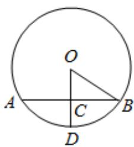

> [!faq]- 2022-2023学年内蒙古呼和浩特二中高一（下）期末数学试卷解析
>
> > [!success]- **【答案】** $4\sqrt{3}\pi$
>
> > [!note]- **【解析】**
> > 作出对应的截面图，
> >
> > ∵截面圆的半径为1，即BC=1，
> >
> > ∵球心O到平面α的距离为 $\sqrt{2}$ ，
> >
> > $$
> > \therefore O C = \sqrt {2}
> > $$
> >
> > 设球的半径为 $\pmb{R}$ ，
> >
> > 在直角三角形OCB中， $OB^{2} = OC^{2} + BC^{2} = 1 + (\sqrt{2})^{2} = 3.$
> >
> > 即 $R^2 = 3$
> >
> > 
> >
> > 解得 $R = \sqrt{3}$
> >
> > ∴该球的体积为 $\frac{4}{3}\pi R^{3}=\frac{4}{3}\times\pi\times(\sqrt{3})^{3}=4\sqrt{3}\pi$
> >
> > 故答案为： $4\sqrt{3}\pi$ .
