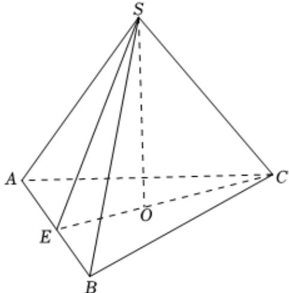

> [!faq]- 2022-2023学年内蒙古呼和浩特二中高一（下）期末数学试卷解析
>
> > [!success]- **【答案】** 详见解析
>
> > [!note]- **【解析】**
> > 详见解析
> >
> > （1）如图，设正三棱锥的底面边长为 $a$ ，斜高为 $h^{\prime}$ ，侧面积、底面积分别为 $S_{1}$ ， $S_{2}$ 过点 $O$ 作 $OE \perp AB$ ，与 $AB$ 交于点 $E$ ，连接 $SE$ ，则 $SE \perp AB$ ， $SE = h^{\prime}$
> >
> > 由 $S_{1}=2S_{2}$ ，即 $\frac{1}{2}\bullet3a\bullet h^{\prime}=\frac{\sqrt{3}}{4}a^{2}\times2$ ，可得 $a=\sqrt{3}h^{\prime}$
> >
> > 由 $SO \perp OE$ ，则 $SO^{2} + OE^{2} = SE^{2}$ ， $OE = \frac{1}{3} CE = \frac{1}{3} \times \frac{\sqrt{3}}{2} a = \frac{\sqrt{3}}{6} a$ ，
> >
> > $$
> > 3 ^ {2} + \left(\frac {\sqrt {3}}{6} \times \sqrt {3} h ^ {\prime}\right) ^ {2} = h ^ {\prime 2}
> > $$
> >
> > $\therefore h^{\prime} = 2\sqrt{3}.$ 则 $a = 6$
> >
> > $\therefore S_{2} = \frac{\sqrt{3}}{4} a^{2} = \frac{\sqrt{3}}{4}\times 6^{2} = 9\sqrt{3}$ ，则 $S_{1} = 18\sqrt{3}.$
> >
> > $\therefore$ 表面积 $S = S_{1} + S_{2} = 18\sqrt{3} +9\sqrt{3} = 27\sqrt{3}$
> >
> > 
> >
> > (2)正三棱锥的体积 $V=\frac{1}{3}S_{\triangle ABC}h=\frac{1}{3}S_{2}\bullet SO=\frac{1}{3}\times9\sqrt{3}\times3=9\sqrt{3}.$
