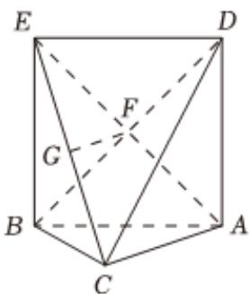
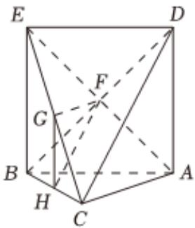

> [!faq]- 2022-2023学年内蒙古呼和浩特二中高一（下）期末数学试卷解析
>
> > [!success]- **【答案】** 详见解析
>
> > [!note]- **【解析】**
> > 详见解析
> >
> > 证明：（1）四边形ABED是平行四边形可知，
> >
> > 连接AE必与BD相交于中点F，故 $GF \parallel AC$ ，
> >
> > ∵ $GF \not\subset$ 面 ABC, AC ⊂ 面 ABC,
> >
> > ∴ $GF \parallel$ 面 ABC ;
> >
> > 
> >
> > (2)由点G，H分别为CE，CB中点可得：GH//EB//AD，
> > ∵ GH≠面ACD，AD⊂面ACD，∴ GH//面ACD，
> > ∵ GF//AC, GF≠面ACD, AC⊂面ACD, ∴ GF//面ACD,
> > ∵ GH∩GF=G,GH, GF⊂平面GFH,
> > 故平面GFH//平面ACD.
> >
> > 
