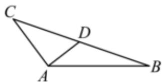

> [!faq]- 2022-2023学年内蒙古呼和浩特二中高一（下）期末数学试卷解析
>
> > [!success]- **【答案】** 详见解析
>
> > [!note]- **【解析】**
> > 详见解析
> >
> > (1) 由已知可得 $\overrightarrow{AD} = \frac{1}{2} (\overrightarrow{AB} + \overrightarrow{AC})$
> >
> > 又 $\overrightarrow{AB} \bullet \overrightarrow{AC} = |\overrightarrow{AB}| \bullet |\overrightarrow{AC}| \bullet \cos \angle BAC = -1, AB = 2, AC = 1,$
> >
> > 
> >
> > 所以 $|\overrightarrow{AD}| = \frac{1}{2}\sqrt{(\overrightarrow{AB} + \overrightarrow{AC})^2} = \frac{1}{2}\sqrt{\overrightarrow{AB}^2 + \overrightarrow{AC}^2 + 2\overrightarrow{AB} \bullet \overrightarrow{AC}} = \frac{\sqrt{3}}{2}$
> >
> > 即线段AD的长为 $\frac{\sqrt{3}}{2}$ ;
> >
> > (2)因为 $AD$ 为 $\angle BAC$ 的平分线，且 $AC = 1, AB = 2$
> >
> > 所以 $\frac{BD}{DC} = \frac{AB}{AC} = 2$ ，所以 $D$ 是得三等分点，
> >
> > 所以 $\overrightarrow{AD} = \frac{1}{3}\overrightarrow{AB} +\frac{2}{3}\overrightarrow{AC}$
> >
> > $$
> > | \overrightarrow {A D} | = | \frac {1}{3} \overrightarrow {A B} + \frac {2}{3} \overrightarrow {A C} | = \frac {1}{3} \sqrt {(\overrightarrow {A B} + 2 \overrightarrow {A C}) ^ {2}} = \frac {2 \sqrt {2}}{3} \sqrt {1 + \cos \angle B A C},
> > $$
> >
> > ①若 $\sin B=\frac{\sqrt{5}}{5}$ ，因为AB=2，AC=1，所以AC<AB，则B<C，故B为锐角，
> >
> > 所以 $\cos B = \sqrt{1 - \sin^2 B} = \sqrt{1 - \frac{1}{5}} = \frac{2\sqrt{5}}{5}$
> >
> > 所以 $cosB = \frac{AB^2 + BC^2 - AC^2}{2AB\bullet AC} = \frac{4 + BC^2 - 1}{2\times 2\bullet AC} = \frac{2\sqrt{5}}{5}$ ，整理得 $BC^2 -\frac{8\sqrt{5}}{5} BC + 3 = 0$
> >
> > 解得 $BC = \sqrt{5}$ ， $BC = \frac{3\sqrt{5}}{5}$
> >
> > 当 $BC = \sqrt{5}$ 时，则 $AB^{2} + AC^{2} = BC^{2}$ ，所以 $AB \perp AC$ ，即 $\angle BAC = 90^{\circ}$
> >
> > 所以 $|\overrightarrow{AD}| = \frac{2\sqrt{2}}{3}\sqrt{1 + cos90^\circ} = \frac{2\sqrt{2}}{3}$
> >
> > 当 $BC = \frac{3\sqrt{5}}{5}$ 时，则 $\cos \angle BAC = \frac{AB^2 + AC^2 - BC^2}{2AB\bullet AC} = \frac{4}{5}$
> >
> > 所以 $|\overrightarrow{AD}| = \frac{2\sqrt{2}}{3}\sqrt{1 + \frac{4}{5}} = \frac{2\sqrt{10}}{5}$
> >
> > 综上，线段AD的长为 $\frac{2\sqrt{2}}{3}$ 或 $\frac{2\sqrt{10}}{5}$ ；
> >
> > ②在 $\triangle ABC$ 中， $\cos \angle BAC \in (-1, 1)$ ，所以 $\sqrt{1 + \cos \angle BAC} \in (0, \sqrt{2})$ ，所以 $AD \in (0, \frac{4}{3})$ .
