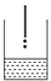
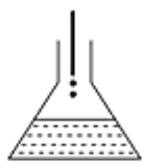
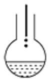
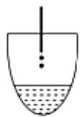
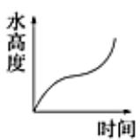
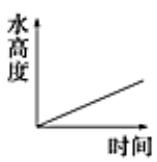
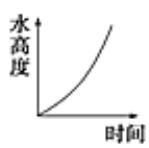
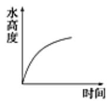

<!-- question-source:start -->
1、水滴进玻璃容器，如图所示（设单位时间内进水量相同），那么水的高度是如何随时间变化的？下列匹配的图象与容器符合实际的有（）

I

II

V

III

(1)

(2)

A I - (2)  
B II - (1)  
C III - (3)  
D V - (4)

(3)

(4)
<!-- question-source:end -->

![[Q00090408A1]]
