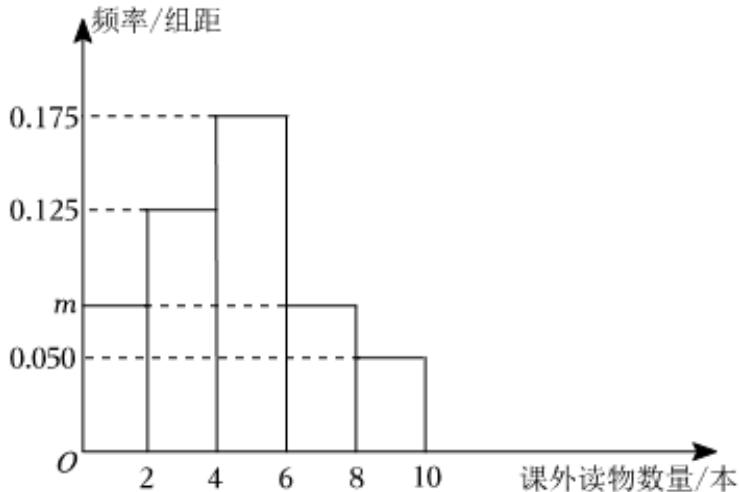

<!-- question-source:start -->
4、某地教体局为了解该地中学生暑假期间阅读课外读物的情况，从该地中学生中随机抽取100人进行调查，根据调查所得数据，按[0,2)，[2,4)，[4,6)，[6,8)，[8,10]分成五组，得到如图所示的频率分布直方图.

(1)求频率分布直方图中m的值；

(2)估计该地中学生暑假期间阅读课外读物数量的平均值；(各组数据以该组中间值作代表)

(3)估计该地中学生暑假期间阅读课外读物数量的中位数.(结果保留一位小数)
<!-- question-source:end -->

![[Q00090419A1]]
