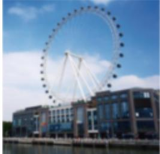
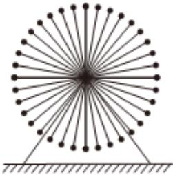

<!-- question-source:start -->
6、摩天轮是一种大型转轮状的机械建筑设施，游客坐在摩天轮的座舱里慢慢的往上转，可以从高处俯瞰四周的景色（如图1）某摩天轮的最高点距离地面的高度为90米，最低点距离地面10米，摩天轮上均匀设置了36个座舱（如图2），开启后摩天轮按逆时针方向匀速转动，游客在座舱离地面最近时的位置进入座舱，摩天轮转完一周后在相同的位置离开座舱摩天轮转一周需要30分钟，当游客甲坐上摩天轮的座舱开始计时.

  
图1

  
图2

(1)经过 $t$ 分钟后游客甲距离地面的高度为 $\pmb{H}$ 米，已知 $\pmb{H}$ 关于 $t$ 的函数关系式满足

$H(t) = A\sin (\omega t + \varphi) + B(\text{其中} A > 0, \omega > 0, |\varphi| \leqslant \pi)$ ，求摩天轮转动一周的解析式 $H(t)$

(2)问：游客甲坐上摩天轮后多长时间，距离地面的高度恰好为30米？
<!-- question-source:end -->

![[Q00090465A1]]
