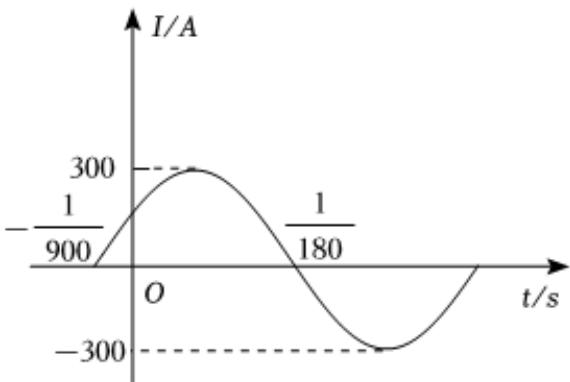

<!-- question-source:start -->
5、已知电流 $I(\text{单位}: A)$ 与时间 $t(\text{单位}: s)$ 的关系为 $I = A \sin(\omega t + \varphi)$ .

(1)如图是该函数在一个周期内的图象，求该函数的解析式； $(A > 0, \omega > 0, |\varphi| < \frac{\pi}{2})$ .

(2)如果t在任意一段 $\frac{1}{150}s$ 的时间内，电流I都能取到最大值和最小值，那么 $\omega$ 的最小值是多少？

<!-- question-source:end -->

![[Q00092159A1]]
