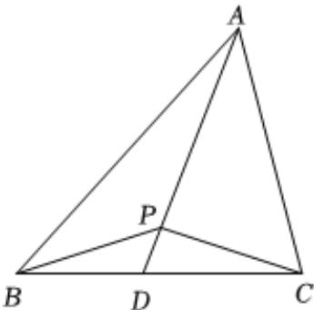

> [!faq]- 2022-2023学年内蒙古呼和浩特市新城区土默特中学高一（下）期中数学试卷解析
>
> > [!success]- **【答案】** D
>
> > [!note]- **【解析】**
> > 如图，延长AP交BC于点D，
> >
> > 
> >
> > 设 $\overrightarrow{AD} = \lambda \overrightarrow{AP}$ ，则 $\overrightarrow{AD} = \frac{\lambda}{2}\overrightarrow{AB} +\frac{\lambda}{3}\overrightarrow{AC}$ ，且 $B,C,D$ 三点共线，
> >
> > 故 $\frac{\lambda}{2} +\frac{\lambda}{3} = 1$ ，得 $\lambda = \frac{6}{5}$
> >
> > $$
> > \overrightarrow {A P} = \frac {5}{6} \overrightarrow {A D}, \overrightarrow {A D} = \frac {3}{5} \overrightarrow {A B} + \frac {2}{5} \overrightarrow {A C}
> > $$
> >
> > $$
> > \therefore S _ {\triangle A B P} = \frac {5}{6} S _ {\triangle A B D}, S _ {\triangle A C P} = \frac {5}{6} S _ {\triangle A C D}
> > $$
> >
> > 因 $\overrightarrow{AD} = \frac{3}{5}\overrightarrow{AB} +\frac{2}{5}\overrightarrow{AC}$
> >
> > 故 $\frac{3}{5} (\overrightarrow{AD} -\overrightarrow{AB}) = \frac{2}{5} (\overrightarrow{AC} -\overrightarrow{AD})$ ，即 $\frac{3}{5}\overrightarrow{BD} = \frac{2}{5}\overrightarrow{DC}$
> >
> > $$
> > \therefore \frac {B D}{C D} = \frac {2}{3},
> > $$
> >
> > $$
> > \therefore \frac {S _ {\triangle A B D}}{S _ {\triangle A C D}} = \frac {2}{3}
> > $$
> >
> > 故 $\frac{S_{\triangle ABP}}{S_{\triangle ACP}} = \frac{\frac{5}{6} S_{\triangle ABD}}{\frac{5}{6} S_{\triangle ACD}} = \frac{2}{3}$ .
> >
> > 故选：D.
