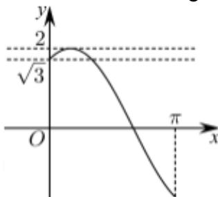

> [!faq]- 2022-2023学年内蒙古呼和浩特市新城区土默特中学高一（下）期中数学试卷解析
>
> > [!success]- **【答案】** $(- \frac {3}{2}, \frac {- 1 - \sqrt {3}}{2} ]$
>
> > [!note]- **【解析】**
> > 令 $y=2\sin(x+\frac{\pi}{3})+2a+1=0$ ，则 $2\sin(x+\frac{\pi}{3})=-1-2a$ ，
> >
> > $$
> > \because \boldsymbol {x} \in [ 0, \pi ], \therefore \boldsymbol {x} + \frac {\pi}{3} \in [ \frac {\pi}{3}, \frac {4 \pi}{3} ]
> > $$
> >
> > $$
> > \therefore - \sqrt {3} \leqslant 2 \sin \left(x + \frac {\pi}{3}\right) \leqslant 2
> > $$
> >
> > 作出 $y=2\sin(x+\frac{\pi}{3})$ 的图象，如下：
> >
> > 
> >
> > 当 $\sqrt{3} \leqslant -1 - 2a < 2$
> >
> > $\therefore -2 < 2a + 1 \leqslant -\sqrt{3}$ ,
> >
> > 解得 $-\frac{3}{2}<a\leqslant\frac{-1-\sqrt{3}}{2}.$
> >
> > $\therefore$ 实数 $a$ 的取值范围是 $\left(-\frac{3}{2}, \frac{-1 - \sqrt{3}}{2}\right]$ .
> >
> > 故答案为： $(- \frac {3}{2}, \frac {- 1 - \sqrt {3}}{2} ]$
> >
> > 4、 $y = 2\cos^2 x + \sin x$
> >
> > $$
> > = 2 - 2 \sin^ {2} x + \sin x
> > $$
> >
> > 令 $t=\sin x$ ，则 $t\in[-1,1]$
> >
> > 则 $y=-2t^{2}+t+2$ ，
> >
> > 由二次函数的图象与性质可得当 $t=\frac{1}{4}$ 时，函数取得最小值为 $-2\times(\frac{1}{4})^{2}+\frac{1}{4}+2=\frac{17}{8}$ .
> > 即函数 $y=2\cos^{2}x+\sin x$ 的最小值是 $\frac{17}{8}$ .
> >
> > 故答案为： $\frac{17}{8}$ .
