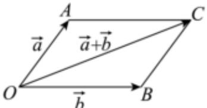

> [!faq]- 2022-2023学年内蒙古呼和浩特市新城区土默特中学高一（下）第一次月考数学试卷解析
>
> > [!success]- **【答案】** BD
>
> > [!note]- **【解析】**
> > 根据单位向量的概念可知，单位向量长都相等，故A正确；
> >
> > 平行向量就是共线向量，故 $B$ 不正确；
> >
> > 将平面向量 $\vec{a}$ 和 $\vec{b}$ 的起点平移到同一点 $O$ ，设它们的终点分别为 $A, B$
> >
> > 当 $\overrightarrow{OA}$ ， $\overrightarrow{OB}$ 不共线时，以 $OA$ ， $OB$ 为邻边作平行四边形 $OACB$ ，则 $\left|\overrightarrow{a} +\overrightarrow{b}\right| <   \left|\overrightarrow{a}\right| + \left|\overrightarrow{b}\right|$
> >
> > 
> >
> > 当 $\overrightarrow{OA}$ ， $\overrightarrow{OB}$ 同向共线时，明显有 $|\vec{a} +\vec{b}| = |\vec{a} | + |\vec{b} |$
> >
> > 当 $\overrightarrow{OA}$ ， $\overrightarrow{OB}$ 反向共线时，明显有 $|\overrightarrow{a} +\overrightarrow{b}| <   |\overrightarrow{a} | + |\overrightarrow{b} |;$
> >
> > 故对于任意的向量 $\overrightarrow{a}$ ， $\overrightarrow{b}$ ，必有 $|\overrightarrow{a} +\overrightarrow{b} |\leq |\overrightarrow{a} | + |\overrightarrow{b} |$ ，故 $C$ 正确；
> >
> > 因为平面向量是既有大小又有方向量的量，是不能比较大小的，故D不正确.
> >
> > 故选：BD.
