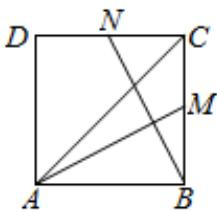

<!-- question-source:start -->
4、如图，正方形ABCD中，M、N分别是BC、CD的中点，若 $\overrightarrow{AC}=\lambda\overrightarrow{AM}+\mu\overrightarrow{BN}$ ，则

$$
\lambda + \mu = ()
$$

$$
\frac {8}{3}
$$

$$
\frac {6}{5}
$$

$$
\frac {8}{5}
$$
<!-- question-source:end -->

![[Q00090425A1]]
