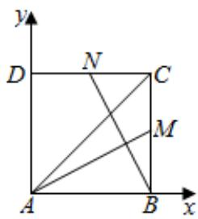

> [!faq]- 2022-2023学年内蒙古师大附中高一（下）月考数学试卷（6月份）解析
>
> > [!success]- **【答案】** D
>
> > [!note]- **【解析】**
> > 以AB，AD为坐标轴建立平面直角坐标系，如图：
> >
> > 设正方形边长为1，则 $\overrightarrow{AM} = (1, \frac{1}{2})$ ， $\overrightarrow{BN} = (-\frac{1}{2}, 1)$ ， $\overrightarrow{AC} = (1, 1)$ 。\$\because \overrightarrow{AC} = \lambda \overrightarrow{AM} + \mu \overrightarrow{BN}\$，\$\therefore \left\{ \begin{array}{l} \lambda - \frac{1}{2} \mu = 1 \\ \frac{1}{2} \lambda + \mu = 1 \end{array} \right.\$，解得\$\left\{ \begin{array}{l} \lambda = \frac{6}{5} \\ \mu = \frac{2}{5} \end{array} \right.\$。 $\therefore \lambda + \mu = \frac{8}{5}$ 。
> >
> > 
> >
> > 故选：D.
