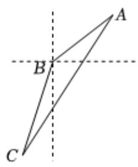

> [!faq]- 2022-2023学年内蒙古师大附中高一（下）月考数学试卷（6月份）解析
>
> > [!success]- **【答案】** D
>
> > [!note]- **【解析】**
> > 由题意可知 $AB = 10$ 千米， $BC = 10\sqrt{3}$ 千米， $\angle ABC = 150^{\circ}$ ，
> >
> > 由余弦定理可得：
> >
> > $$
> > A C ^ {2} = A B ^ {2} + B C ^ {2} - 2 A B \bullet B C \cos \angle A B C = 1 0 ^ {2} + (1 0 \sqrt {3}) ^ {2} - 2 \times 1 0
> > $$
> >
> > $$
> > \times 1 0 \sqrt {3} \times (- \frac {\sqrt {3}}{2}) = 7 0 0
> > $$
> >
> > 
> >
> > 则 $AC = 10\sqrt{7}$ 千米.
> >
> > 故选：D.
