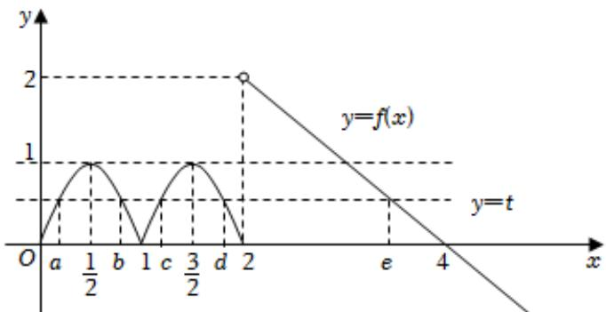

> [!faq]- 2022-2023学年内蒙古师大附中高一（下）月考数学试卷（6月份）解析
>
> > [!success]- **【答案】** BCD
>
> > [!note]- **【解析】**
> > 因函数 $f(x)=\left\{\begin{aligned}&|sin\pi x|,0\leqslant x\leqslant2\\ &4-x,x>2\end{aligned}\right.$ 则 $f(\frac{1}{2})=|\sin\frac{\pi}{2}|=1,f(3)=4-3=1,A$ 不正确； $f(\frac{1}{3})=\left|sin\frac{\pi}{3}\right|=\frac{\sqrt{3}}{2},f(\frac{7}{4})=\left|sin\frac{7\pi}{4}\right|$ $=\frac{\sqrt{2}}{2}$ ，B正确；
> >
> > 
> >
> > 当 $0 \leqslant x \leqslant 2$ 时， $0 \leqslant f(x) \leqslant 1$ ，则不等式 $f(x) > 1$ 化为 $\left\{ \begin{array}{l} x > 2 \\ 4 - x > 1 \end{array} \right.$ ，解得 $2 < x < 3$ ，所以 $f(x) > 1$ 的解集为 $(2,3)$ ， $C$ 正确；因存在实数 $a, b, c, d, e (a < b < c < d < e)$ 满足 $f(a) = f(b) = f(c) = f(d) = f(e)$ ，令 $f(a) = t$ ，则方程 $f(x) = t$ 有4个互异实根 $a, b, c, d, e$ ，即函数 $y = f(x)$ 的图象与直线 $y = t$ 有4个公共点，作出函数 $y = f(x)$ 的图象与直线 $y = t$ ，如图，  
> > 因当 $0 \leqslant x \leqslant 2$ 时， $0 \leqslant f(x) \leqslant 1$ ，则 $0 < t < 1$ ，又 $f(x) = |\sin \pi x|$ 在 $[0,1]$ 上的图象关于直线 $x = \frac{1}{2}$ 对称，在 $[1,2]$ 上的图象关于直线 $x = \frac{3}{2}$ 对称，因此有： $a + b = 1, c + d = 3, e = 4 - t$ ，则 $af(a) + bf(b) + cf(c) + df(d) + ef(e) = t(8 - t)$ ，而函数 $y = -t^2 + 8t$ 在 $(0,1)$ 上递增，则有 $0 < t(8 - t) < 7$ ，所以 $af(a) + bf(b) + cf(c) + df(d) + ef(e)$ 的取值范围为 $(0,7)$ ， $D$ 正确。故选：BCD。
