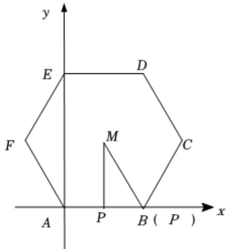

> [!faq]- 2022-2023学年内蒙古师大附中高一（下）月考数学试卷（6月份）解析
>
> > [!success]- **【答案】** $[-1,0]$
>
> > [!note]- **【解析】**
> > 如图，以 $A$ 为坐标原点 $AB$ ， $AE$ 分别为 $\pmb{x}$ ， $\pmb{y}$ 轴建立平面直角坐标系，
> >
> > 
> >
> > 则 $A(0,0),D(2,2\sqrt{3})$ ，设正六边形ABCDEF的中心为 $M$ ，则 $M(1,\sqrt{3})$ 设点 $P(x,y)$ ，则 $\overrightarrow{PA} = (-x, - y),\overrightarrow{PD} = (2 - x,2\sqrt{3} -y)$
> >
> > $$
> > \overrightarrow {P A} \cdot \overrightarrow {P D} = (- x, - y) \cdot (2 - x, 2 \sqrt {3} - y) = (x - 1) ^ {2} + (y - \sqrt {3}) ^ {2} - 4
> > $$
> >
> > 而 $(x - 1)^2 + (y - \sqrt{3})^2$ 表示点 $P(x, y)$ 和 $M(1, \sqrt{3})$ 的距离的平方，
> >
> > 即 $(x - 1)^2 + (y - \sqrt{3})^2 = |PM|^2$ ，而 $|PM| \in [\sqrt{3}, 2]$ ，
> >
> > 当 $P$ 位于边的中点处取最小值，位于顶点处取值大值，
> >
> > 故 $(x - 1)^2 + (y - \sqrt{3})^2 = |PM|^2 \in [3, 4]$
> >
> > 所以 $\overrightarrow{PA} \cdot \overrightarrow{PD} = (x - 1)^2 + (y - \sqrt{3})^2 - 4 \in [-1, 0]$
> >
> > 故答案为： $[-1,0]$ .
