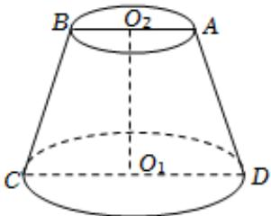

<!-- question-source:start -->
4、某班级到一工厂参加社会实践劳动，加工出如图所示的圆台 $O_{1}O_{2}$ ，在轴截面ABCD中， $AB = AD = BC = 2cm$ ，且 $CD = 2AB$ ，下列说法正确的有（）
A $\angle ADC = 30^{\circ}$ B 该圆台轴截面ABCD面积为 $3\sqrt{3} cm^{2}$ C 该圆台的体积为 $\frac{7\sqrt{3}\pi}{3} cm^{3}$ D 沿着该圆台表面，从点C到AD中点的最短距离为5cm

<!-- question-source:end -->

![[Q00091575A1]]
