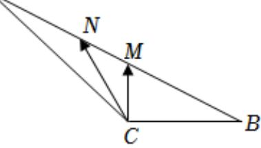

<!-- question-source:start -->
4、在△ABC中，AC=2BC=4，∠ACB为钝角，M，N是边AB上的两个动点，且A

MN=1，若 $\overrightarrow{CM}\cdot\overrightarrow{CN}$ 的最小值为 $\frac{3}{4}$ ，则 $\cos\angle ACB=$ \_\_\_\_.

<!-- question-source:end -->

![[Q00091579A1]]
