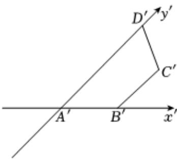

<!-- question-source:start -->
3、用斜二测画法画一个水平放置的平面图形的直观图为如图所示，已知 $A'B' = 2$ ， $B'C' = 3$ ， $A'D' = 4$ 且 $A'D'' / / B'C'$

(1)求原平面图形ABCD的面积；

(2)将原平面图形ABCD绕AD旋转一周，求所形成的空间几何体的表面积和体积.

<!-- question-source:end -->

![[Q00091582A1]]
