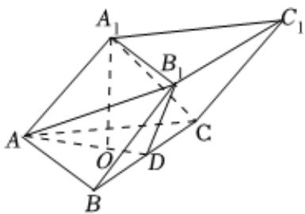

<!-- question-source:start -->
5、如图，三棱柱 $ABC-A_{1}B_{1}C_{1}$ 的各棱的长均为2， $A_{1}$ 在底面上的射影为 $\triangle ABC$ 的重心O.

(1)若D为BC的中点，求证： $A_{1}C \parallel$ 平面 $ADB_{1}$ ；

(2)求四棱锥 $C-ABB_{1}A_{1}$ 的体积.

<!-- question-source:end -->

![[Q00092161A1]]
