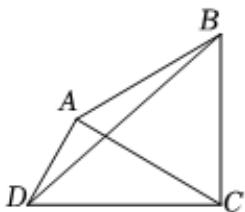

<!-- question-source:start -->
6、欲在某湿地公园内搭建一个形状为平面凸四边形ABCD的休闲、观光及科普宣教的平台，如图所示，其中DC=4(单位：百米)，DA=2(单位：百米)，△ABC为正三角形.建成后△BCD将作为人们旅游观光、休闲娱乐的区域，△ABD将作为科普宣教文化的区域.

(1)当 $\angle ADC = \frac{\pi}{3}$ 时，求旅游观光、休闲娱乐的区域 $\triangle BCD$ 的面积；

(2)求旅游观光、休闲娱乐的区域 $\triangle BCD$ 面积的最大值.

<!-- question-source:end -->

![[Q00092162A1]]
