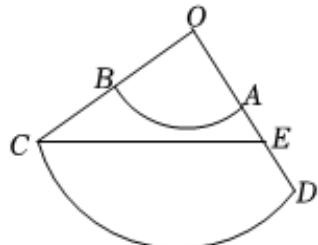

> [!faq]- 2022-2023学年内蒙古师大附中高一（下）期末数学试卷解析
>
> > [!success]- **【答案】** BCD
>
> > [!note]- **【解析】**
> > 对于 $A$ ，由已知及题图知， $\cos \angle ADC = \frac{1}{2}$ 且 $0 <   \angle ADC <   \frac{\pi}{2}$
> >
> > $\therefore \angle ADC = 60^{\circ}$ ，故 $A$ 错误；
> >
> > 对于B，由A知，圆台高为 $h=2\times\sin60^{\circ}=\sqrt{3}$ ，
> >
> > $\therefore$ 圆台轴截面 $ABCD$ 面积为 $S = \frac{1}{2} \times (2 + 4) \times \sqrt{3} = 3\sqrt{3} cm^2$ ，故 $B$ 正确；
> >
> > 对于 $C$ ，圆台的体积 $V = \frac{1}{3}\times (1^{2} + \sqrt{1^{2}\times 2^{2}} +2^{2})\times \sqrt{3}\pi = \frac{7\sqrt{3}\pi}{3} cm^3$ ，故 $C$ 正确；
> >
> > 对于 $D$ ，将圆台一半侧面展开，如下图中ABCD，且 $\pmb{E}$ 为 $AD$ 中点，
> >
> > 而圆台对应的圆锥体侧面展开为扇形COD，且OC = 4，
> >
> > 
> >
> > $\because \angle COD = \frac{2\pi}{4} = \frac{\pi}{2},\therefore$ 在 $Rt\triangle COE$ 中， $CE = \sqrt{4^2 + 3^2} = 5cm$
> >
> > 即C到AD中点的最短距离为5cm，故D正确.
> >
> > 故选：BCD.
