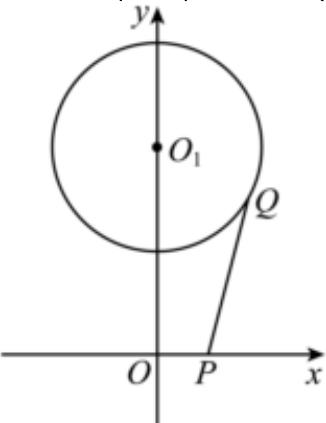

> [!faq]- 2022-2023学年内蒙古师大附中高一（下）期末数学试卷解析
>
> > [!success]- **【答案】** $[\sqrt{17} -2,\sqrt{17} +2]$
>
> > [!note]- **【解析】**
> > 设 $z = a + bi, a, b$ 为实数，因为 $\vert z - 4i\vert = 2$
> >
> > 所以 $|a+(b-4)i|=2$ ，即 $\sqrt{a^{2}+(b-4)^{2}}=2$ ，
> >
> > 所以 $a^{2}+(b-4)^{2}=4$ ，
> >
> > 所以复数 $z$ 对应的点的轨迹是以 $(0,4)$ 为圆心，2为半径的圆.
> >
> > $|z - 1| = |(a - 1) + bi|$ 则表示 $(a, b)$ 到 $(1, 0)$ 的距离，
> >
> > 即图中的 $|PQ|$ ，其中 $P(1,0)$ ， $Q(a,b)$ 在圆上移动，由图可知，
> >
> > 
> >
> > $|O_1P| - 2 \leqslant |PQ| \leqslant |O_1P| + 2$ ，即 $\sqrt{17} - 2 \leqslant |PQ| \leqslant \sqrt{17} + 2$
> >
> > 故答案为： $[\sqrt{17} -2,\sqrt{17} +2]$
