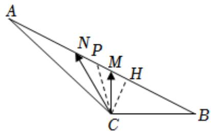

> [!faq]- 2022-2023学年内蒙古师大附中高一（下）期末数学试卷解析
>
> > [!success]- **【答案】** $\frac{1-3\sqrt{5}}{8}$
>
> > [!note]- **【解析】**
> > 如图所示，取MN的中点P，则 $\overrightarrow{PN} = -\overrightarrow{PM}$
> >
> > $$
> > | \overrightarrow {P N} | = | \overrightarrow {P M} | = \frac {1}{2}
> > $$
> >
> > $$
> > \overrightarrow {C M} \bullet \overrightarrow {C N} = (\overrightarrow {C P} + \overrightarrow {P M}) \bullet (\overrightarrow {C P} + \overrightarrow {P N}) = (\overrightarrow {C P} + \overrightarrow {P M})
> > $$
> >
> > $$
> > \bullet (\overrightarrow {C P} - \overrightarrow {P M}) = C P ^ {2} - \frac {1}{4}
> > $$
> >
> > 
> >
> > 因为 $\overrightarrow{CM} \bullet \overrightarrow{CN}$ 的最小值为 $\frac{3}{4}$ ，所以 $CP_{\min} = 1$ .
> >
> > 作 $CH \perp AB$ ，垂足为H，则 $CH = CP_{\min} = 1$ ，
> >
> > 又 $BC = 2$ ，所以 $B = 30^{\circ}$
> >
> > 在 $\triangle ABC$ 中，由正弦定理知， $\frac{BC}{\sin A} = \frac{AC}{\sin B}$ ，即 $\frac{2}{\sin A} = \frac{4}{\frac{1}{2}}$ ，所以 $\sin A = \frac{1}{4}$
> >
> > 因为 $\angle ACB$ 为钝角，所以 $A\in (0,90^{\circ})$ ， $\cos A = \sqrt{1 - \sin^2A} = \frac{\sqrt{15}}{4}$ 所以
> >
> > $$
> > \cos \angle A C B = \cos (1 5 0 ^ {\circ} - A) = - \frac {\sqrt {3}}{2} \cos A + \frac {1}{2} \sin A = - \frac {\sqrt {3}}{2} \times \frac {\sqrt {1 5}}{4} + \frac {1}{2} \times \frac {1}{4} = \frac {1 - 3 \sqrt {5}}{8}.
> > $$
> >
> > 故答案为： $\frac{1-3\sqrt{5}}{8}$ .
