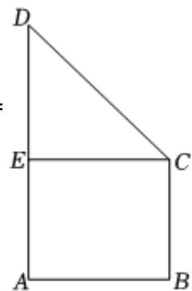

> [!faq]- 2022-2023学年内蒙古师大附中高一（下）期末数学试卷解析
>
> > [!success]- **【答案】** 详见解析
>
> > [!note]- **【解析】**
> > 详见解析
> >
> > (1) 根据题意, 由斜二测画法, 可知原平面图形 $ABCD$ 是直角梯形, 如图: 且直角梯形 $ABCD$ 的上底 $BC = 6$ , 下底是 $AD = 8$ , 高 $AB = 2$ ,
> >
> > 所以原平面图形ABCD的面积 $S=\frac{1}{2}(AD+BC)\times AB=\frac{1}{2}\times(6+8)\times2=14$
> >
> > (2)根据题意，将原平面图形ABCD绕AD旋转一周，所得几何体由等底的圆柱和圆锥组成，
> >
> > 其中圆锥的底面半径为2，高为2，圆柱的底面半径为2，高为6，
> >
> > 
> >
> > 所形成的空间几何体的表面积为
> >
> > $$
> > \pi \times 2 ^ {2} + 2 \pi \times 2 \times 6 + \pi \times 2 \times 2 \sqrt {2} = (2 8 + 4 \sqrt {2}) \pi ,
> > $$
> >
> > 体积为 $\pi \times 2^2 \times 6 + \frac{1}{3} \times \pi \times 2^2 \times 2 = \frac{80}{3}\pi.$
