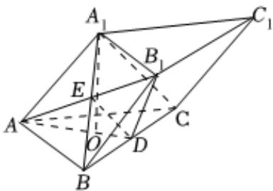

> [!faq]- 2022-2023学年内蒙古师大附中高一（下）期末数学试卷解析
>
> > [!success]- **【答案】** 详见解析
>
> > [!note]- **【解析】**
> > 详见解析
> >
> > (1) 连接 $A_{1} B$ 交 $A B_{1}$ 于点 $\pmb{E}$ , 连接 $D E$ , 则 $\pmb{E}$ 为 $A_{1} B$ 的中点,
> >
> > 
> >
> > 又∵D为BC的中点，∴DE为△ $A_{1}$ BC的中位线，
> >
> > $$
> > \therefore D E \parallel A _ {1} C, (3 \text {分})
> > $$
> >
> > 又 $A_{1}C\not\subset$ 平面 $ADB_{1}$ ， $DE\subset$ 平面 $ADB_{1}$
> >
> > $\therefore A_{1}C \parallel$ 平面 $ADB_{1}$ ; (6分)
> >
> > (2)在 $\triangle ABC$ 中， $O$ 为重心，则 $AO = \frac{2}{3} AD = \frac{2\sqrt{3}}{3}$
> >
> > 在 $Rt\triangle AOA_{1}$ 中， $A_{1}O = \sqrt{AA_{1}^{2} - AO^{2}} = \frac{2\sqrt{6}}{3}$ ，(9分）
> >
> > $$
> > V _ {C - A B B _ {1} A _ {1}} = \frac {2}{3} V _ {A B C - A _ {1} B _ {1} C _ {1}} = \frac {2}{3} \times \frac {\sqrt {3}}{4} \times 2 ^ {2} \times \frac {2 \sqrt {6}}{3} = \frac {4 \sqrt {2}}{3}. (1 2 \text {分})
> > $$
