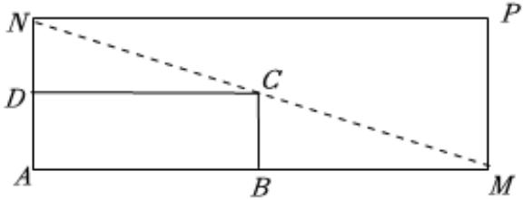

<!-- question-source:start -->
5、如图所示，为增加学生劳动技术实践活动区域，学校计划将一矩形试验田ABCD扩建成一个更大的矩形试验田AMPN，要求M在AB的延长线上，N在AD的延长线上，且对角线MN过C点.已AB=6米，AD=2米，设

$AN = x$ （单位：米），记矩形试验田AMPN的面积为S.

(1)要使 $S$ 不小于64平方米，求 $\pmb{x}$ 的取值范围；

(2)若 $x\in[3,\frac{9}{2}]$ （单位：米），求S的最大值及此时AN的长度.

<!-- question-source:end -->

![[Q00092167A1]]
