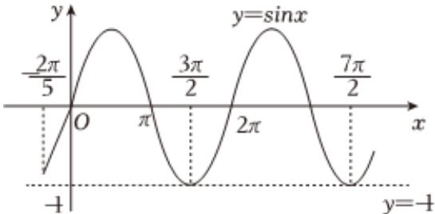

> [!faq]- 2022-2023学年内蒙古赤峰二中高一（下）第一次月考数学试卷解析
>
> > [!success]- **【答案】** AC
>
> > [!note]- **【解析】**
> > 由题意若 $f(x)$ 的图象与直线 $y = -1$ 在 $[0, 2\pi]$ 上有且仅有1个交点，
> >
> > 则 $\omega x - \frac{2\pi}{5} \in \left[-\frac{2\pi}{5}, 2\omega \pi - \frac{2\pi}{5}\right]$ ，结合正弦函数图像，如图：
> >
> > 
> >
> > 由于 $-\frac{\pi}{2} < -\frac{2\pi}{5}$ ，故 $\frac{3\pi}{2} \leq 2\omega\pi - \frac{2\pi}{5} < \frac{7\pi}{2}$ ，
> >
> > 解得 $\frac{19}{20} \leq \omega < \frac{39}{20}$ ，即 $\omega \in \left[\frac{19}{20}, \frac{39}{20}\right)$ ，故 $A$ 正确；
> >
> > 结合以上分析可知 $\omega x - \frac{2\pi}{5} \in \left[-\frac{2\pi}{5}, 2\omega \pi - \frac{2\pi}{5}\right], 2\omega \pi - \frac{2\pi}{5} \in \left[\frac{3\pi}{2}, \frac{7\pi}{2}\right)$
> >
> > 令 $\omega x - \frac{2\pi}{5} = k\pi, k \in Z$ 时， $f(x) = 0$
> >
> > 由此可知 $\omega x - \frac{2\pi}{5} = 0$ ， $\pi$ 时，函数一定有2个零点，
> >
> > 当 $\omega x - \frac{2\pi}{5} = 2\pi$ ， $3\pi$ 时，相应的 $x$ 可能是函数的零点，也可能不是，
> >
> > 即 $f(x)$ 在 $[0, 2\pi]$ 上可能有2个零点，也可能有3或4个零点，故 $B$ 错误；
> >
> > $f(x)$ 的图象向右平移 $\frac{\pi}{12}$ 个单位长度后关于 $y$ 轴对称，
> >
> > $$
> > y = \sin [ \omega (x - \frac {\pi}{1 2}) - \frac {2 \pi}{5} ] = \sin (\omega x - \frac {\omega \pi}{1 2} - \frac {2 \pi}{5})
> > $$
> >
> > 则 $-\frac{\omega\pi}{12} - \frac{2\pi}{5} = \frac{\pi}{2} + k\pi, k \in Z$ ，即 $\omega = -\frac{54}{5} - 12k, k \in Z$
> >
> > 只有当 $k = -1$ 时， $\omega = \frac{6}{5}\in \left[\frac{19}{20},\frac{39}{20}\right)$ ，故 $C$ 正确；
> >
> > 将 $f(x)$ 图象上各点的横坐标变为原来的 $\frac{1}{2}$ ，得到函数 $g(x)$ 的图象，
> >
> > 则 $g(x) = \sin (2\omega x - \frac{2\pi}{5})$ ， $x\in [0,\frac{\pi}{4} ]$ ，则 $2\omega x - \frac{2\pi}{5}\in [-\frac{2\pi}{5},\frac{\omega\pi}{2} -\frac{2\pi}{5} ]$
> >
> > 由于 $\omega \in \left[\frac{19}{20},\frac{39}{20}\right)$ ，故 $\frac{\omega\pi}{2} -\frac{2\pi}{5}\in \left[\frac{3\pi}{40},\frac{23\pi}{40}\right)$ ，而 $-\frac{\pi}{2} <  - \frac{2\pi}{5},\frac{3\pi}{40} <  \frac{\pi}{2} <  \frac{23\pi}{40}$
> >
> > 故 $g(x)$ 在 $[0, \frac{\pi}{4}]$ 上不一定单调递增，故D错误.
> >
> > 故选：AC.
