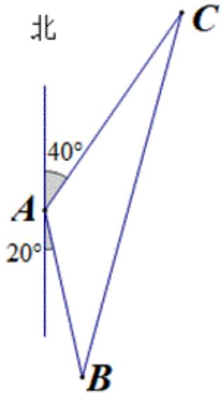

> [!faq]- 2022-2023学年内蒙古赤峰二中高一（下）第一次月考数学试卷解析
>
> > [!success]- **【答案】** 4
>
> > [!note]- **【解析】**
> > 设轮船从点A出发到达点C，灯塔在点B，如图所示，
> >
> > 
> >
> > 由图可知， $\angle BAC = 180^{\circ} - 40^{\circ} - 20^{\circ} = 120^{\circ}$ ， $|AC| = 18\times \frac{20}{60} = 6$ 海里，
> >
> > 在 $\triangle ABC$ 中，由余弦定理知， $|BC|^2 = |AB|^2 + |AC|^2 - 2|AB| \cdot |AC| \cdot \cos \angle BAC$
> >
> > 所以 $(2\sqrt{19})^2 = |AB|^2 + 6^2 - 2|AB| \cdot 6 \cdot (-\frac{1}{2})$ ，即 $|AB|^2 + 6|AB| - 40 = 0$
> >
> > 解得 $|AB|=4$ 或-10(舍负)，
> >
> > 所以灯塔与轮船原来的距离为4海里.
> >
> > 故答案为：4.
