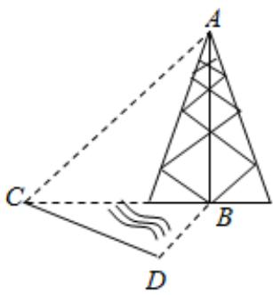

<!-- question-source:start -->
6、如图，测量河对岸的塔高AB时，可以选与塔底B在同一水平面内的两个观测点C，D，测得 $\angle BCD=15^{\circ}$ ， $\angle CBD=30^{\circ}$ ， $CD=10\sqrt{2}m$ ，并在C处测得塔顶A的仰角为 $45^{\circ}$ ，则塔高AB=（）

A $30\sqrt{2} m$ B $20\sqrt{3} m$ C $30m$ D $20m$
<!-- question-source:end -->

![[Q00092174A1]]
