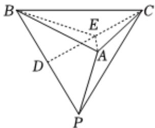

<!-- question-source:start -->
4、如图所示，有一个棱长为4的正四面体 $P - ABC$ 容器， $D$ 是 $PB$ 的中点， $E$ 是 $CD$ 上的动点，则下列说法正确的是（）

A 线段 $AE$ 的最小值是 $\frac{4\sqrt{6}}{3}$

B $\triangle ABE$ 的周长最小值为 $4 + \sqrt{34}$

C 如果在这个容器中放入1个小球（全部进入），则小球半径的最大值为 $\frac{\sqrt{6}}{3}$

D 如果在这个容器中放入10个完全相同的小球（全部进入），则小球半径的最大值为 $\sqrt{6} - 2$
<!-- question-source:end -->

![[Q00092180A1]]
