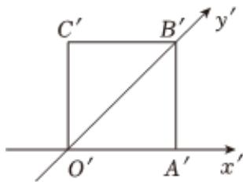

<!-- question-source:start -->
3. 复数z满足2z+ $\overline{z}$ =6-i（i是虚数单位），则z的虚部为\_\_\_\_。

如图所示，正方形O'A'B'C'的边长为2cm，它是水平放置的一个平面图形的直观图，则原图形的周长是 \_\_\_\_ cm。

<!-- question-source:end -->

![[Q00092182A1]]
