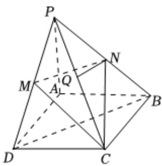

<!-- question-source:start -->
5、如图，在四棱锥 $P - ABCD$ 中，底面ABCD是菱形， $N, M, Q$ 分别为 $PB, PD, PC$ 的中点.

(1)求证：QN//平面PAD；

(2)记平面CMN与底面ABCD的交线为l，试判断直线l与平面PBD的位置关系，并证明.

<!-- question-source:end -->

![[Q00092188A1]]
