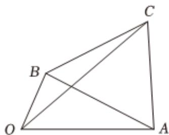

<!-- question-source:start -->
6、如图，四边形OACB中，OA=2，OB=1，三角形ABC为正三角形.

(1)当 $\angle AOB = \frac{\pi}{3}$ 时，设 $\overrightarrow{OC} = x\overrightarrow{OA} +y\overrightarrow{OB}$ ，求 $x$ ， $y$ 的值；

(2)设 $\angle AOB=\theta(0<\theta<\pi)$ ，则当 $\theta$ 为多少时.

①四边形OACB的面积S最大，最大值是多少？

②线段OC的长最大，最大值是多少？

<!-- question-source:end -->

![[Q00092189A1]]
