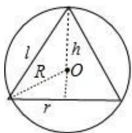

> [!faq]- 2022-2023学年内蒙古赤峰二中高一（下）第二次月考数学试卷解析
>
> > [!success]- **【答案】** A
>
> > [!note]- **【解析】**
> > 画出圆锥的轴截面，如图所示：
> >
> > 设球 $O$ 的半径为 $\pmb{R}$ ，则 $4\pi R^2 = 16\pi$ ，解得 $R = 2$
> >
> > 设圆锥底面圆的半径为 $r$ ，则 $r = \sqrt{2^2 - 1^2} = \sqrt{3}$
> >
> > 所以圆锥的高为 $h = 3$ ，
> >
> > 圆锥的母线长为 $l = \sqrt{(\sqrt{3})^2 + 3^2} = 2\sqrt{3}$
> >
> > 
> >
> > 所以该圆锥的侧面积为 $S_{\text{侧}} = \pi \times \sqrt{3} \times 2\sqrt{3} = 6\pi.$
> >
> > 故选：A.
