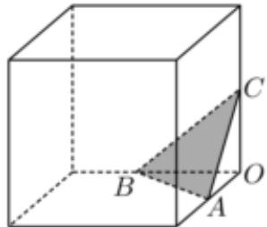
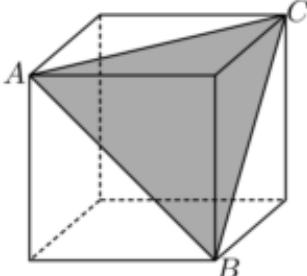
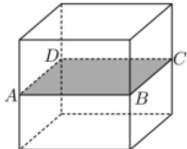
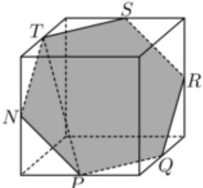

> [!faq]- 2022-2023学年内蒙古赤峰二中高一（下）第二次月考数学试卷解析
>
> > [!success]- **【答案】** BCD
>
> > [!note]- **【解析】**
> > 对于 $A$ 选项，一个平面与正方体共点的3个面相交，截面为三角形，此三角形不可能是直角三角形，如图，截面为 $\triangle ABC$ ，点 $O$ 为正方体的顶点，
> >
> > 在三棱锥 $O - ABC$ 中， $OA$ 、 $OB$ 、 $OC$ 两两垂直，
> >
> > 
> >
> > 若 $\triangle ABC$ 为直角三角形，不妨令 $\angle BAC = 90^{\circ}$ ，则 $BC^{2} = AB^{2} + AC^{2}$ 而 $BC^2 = OB^2 +OC^2$ ， $AB^{2} = OA^{2} + OB^{2}$ ， $AC^2 = OC^2 +OA^2$
> >
> > 因此 $2OA^{2} = 0$ ，矛盾，故选项 $\mathbf{A}$ 错误；
> >
> > 对于 $B$ 选项，当截面为下图所示的 $\triangle ABC$ 时，截面为等边三角形，如下图所示：
> >
> > 
> >
> > 故选项B正确；
> >
> > 对于 $C$ 选项，当截面与正方形的底面平行时，截面为正方形，如下图所示：
> >
> > 
> >
> > 故选项C正确；
> >
> > 对于 $D$ 选项，一个平面与正方体的6个面相交，截面为六边形，此六边形可能是正六边形，
> >
> > 
> >
> > 如图，N、P、Q、R、S、T为正方体所在棱的中点，顺次连接得正六边形，
> >
> > 设正方体棱长为 $a$ ，有 $TN = NP = PQ = QR = RS = ST = \frac{\sqrt{2}}{2} a, PT = \frac{\sqrt{6}}{2} a,$ $\triangle NPT$ 中， $cos\angle PNT = \frac{NT^2 + NP^2 - PT^2}{2NT\bullet NP} = -\frac{1}{2}$ ，则 $\angle PNT = 120^{\circ}$ 同理 $\angle NPQ = \angle PQR = \angle QRS = \angle RST = \angle STN = 120^{\circ}$ ，即六边形NPQRST为正六边形，故选项 $D$ 正确.
> >
> > 故选：BCD.
