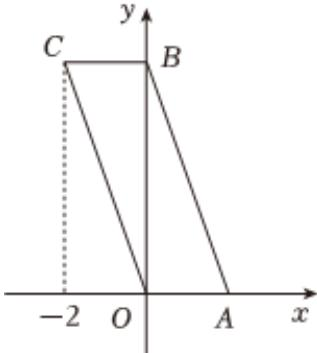

> [!faq]- 2022-2023学年内蒙古赤峰二中高一（下）第二次月考数学试卷解析
>
> > [!success]- **【答案】** 16
>
> > [!note]- **【解析】**
> > 由已知可得， $O'B' = 2\sqrt{2}$
> >
> > 则将直观图还原为原图形如下图：
> >
> > 
> >
> > 原图形为平行四边形，其中， $OA = BC = 2$ ， $OB = 2O'B' = 4\sqrt{2}$
> >
> > 所以 $OC = AB = \sqrt{OA^2 + OB^2} = 6$
> >
> > 所以平行四边形OABC的周长为OA+AB+BC+CO=2+6+2+6=16.故答案为：16.
