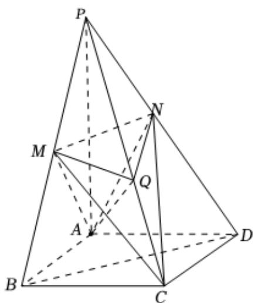

> [!faq]- 2022-2023学年内蒙古赤峰二中高一（下）第二次月考数学试卷解析
>
> > [!success]- **【答案】** 详见解析
>
> > [!note]- **【解析】**
> > 详见解析
> >
> > （1）证明：∵底面ABCD是菱形，N，M，Q分别为PB，PD，PC的中点.
> > ∴ QN // BC, BC // AD, ∴ QN // AD,
> > ∵ QN ≠ 平面PAD, AD ⊂ 平面PAD,
> > ∴ QN // 平面PAD;
> > (2) 直线l与平面PBD平行，证明如下：
> > 连接BD, ∵ N, M, Q分别为PB, PD, PC的中点，
> > ∴ MN // BD,
> > ∵ BD ⊂ 平面ABCD, MN ≠ 平面ABCD,
> > ∴ MN // 平面ABCD,
> > ∵ 平面CMN与底面ABCD的交线为l，∴ 由线面平行的性质得MN // l
> > ∵ MN // BD, ∴ BD // l,
> > ∵ C ∈ l, C ≠ BD，且BD ⊂ 平面PBD, l ≠ 平面PBD,
> > ∴ l // 平面PBD.
> >
> > 
