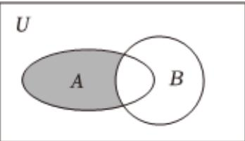

<!-- question-source:start -->
1、若全集 $U = R$ ，集合 $A = \{0,1,2,3,4,5\}$ ， $B = \{x\mid x\geqslant 3\}$ ，则图中阴影部分表示的集合为（）A{3,4,5}B{0,1,2}C{0,1,2,3}D{4,5}

<!-- question-source:end -->

![[Q00091588A1]]
