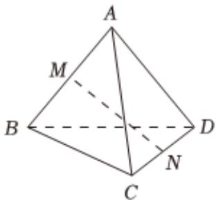

<!-- question-source:start -->
5、为落实党的二十大提出的“加快建设农业强国，扎实推动乡村振兴”的目标，银行拟在乡村开展小额贷款业务。根据调查的数据，建立了实际还款比例 $P$ 关于还款人的年收入 $\pmb{x}$ （单位：万元）的Logistic模型： $P(\pmb{x}) = \frac{e^{-0.9 + kx}}{1 + e^{-0.9 + kx}}$ 。已知当贷款人的年收入为9万元时，其实际还款比例为 $50\%$ 。若银行希望实际还款比例为 $40\%$ ，则贷款人的年收入约为（）(参考数据： $\ln 3 \approx 1.1, \ln 2 \approx 0.7$ )  
A 4万元  
B 8万元  
C 6万元  
D 5万元

<!-- question-source:end -->

![[Q00091592A1]]
