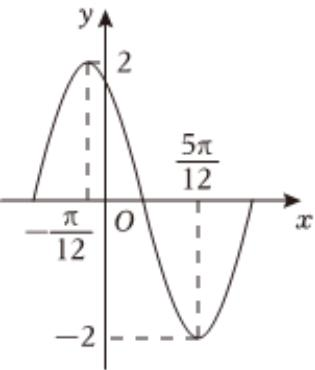
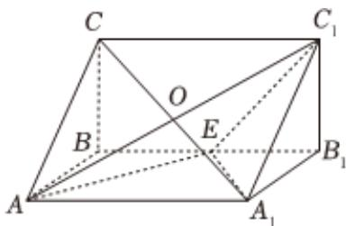

<!-- question-source:start -->
2、函数 $f(x)=A\sin(\omega x+\varphi)(A>0,\omega>0$ ，且 $|\varphi|<\pi)$ 在一个周期内的图象如图所示，下列结论正确的是（）

A $f(x) = 2\sin (2x + \frac{\pi}{3})$

B $f(x)$ 的图象关于点 $(- \frac{\pi}{3}, 0)$ 对称

C $f(x)$ 的图象的对称轴为直线 $x = -\frac{7\pi}{12}$

D 若方程 $f(x) = m$ 在 $[0, \frac{\pi}{2}]$ 上有两个不相等的实数根，则 $m$ 的取值范围是 $(-2, -\sqrt{3}]$

<!-- question-source:end -->

![[Q00091597A1]]
