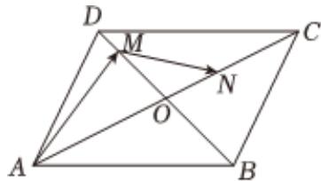

<!-- question-source:start -->
3、如图，平行四边形ABCD的对角线AC、BD交于O点，线段OD上有点M满足 $\overrightarrow{DO} = 3\overrightarrow{DM}$ ，线段CO上有点N满足 $\overrightarrow{OC} = 2\overrightarrow{ON}$ ，设 $\overrightarrow{AB} = \overrightarrow{a}$ ， $\overrightarrow{AD} = \overrightarrow{b}$ ，已知 $\overrightarrow{MN} = x\overrightarrow{a} + y\overrightarrow{b}$ ，则 $x+y=$ \_\_\_\_。

<!-- question-source:end -->

![[Q00091602A1]]
